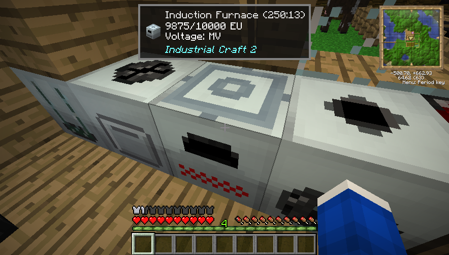
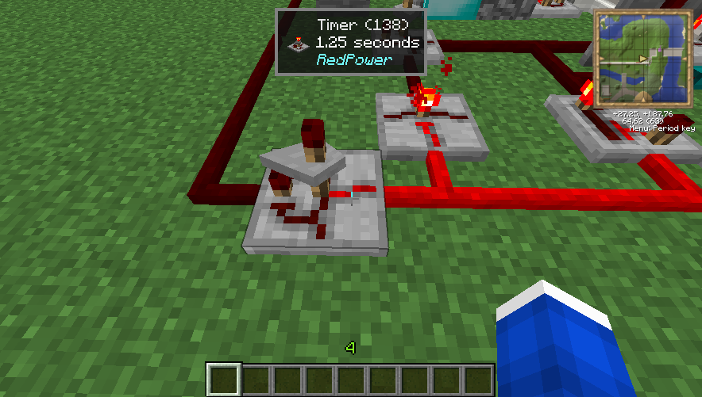

# What is this thing?

If you've played tekkit classic, you probably know there's no Waila mod to tell you what you're looking at. This mod brings back some of that so that you can see what block or entity you're looking at.

[Click here if you want to compile this for yourself](setting-up/README_FIRST_DONT_RUN_SETUP.md)

## CurseForge link
https://legacy.curseforge.com/minecraft/mc-mods/whatisthisthing

# Licence
Licenced under MIT licence
